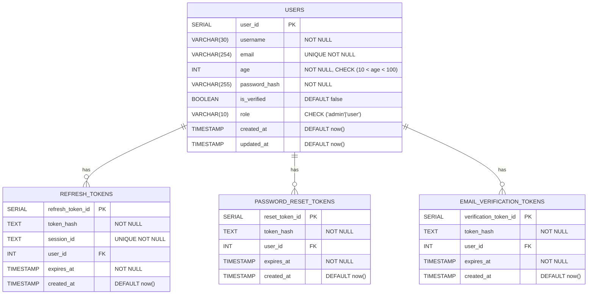

# Secure Auth Backend

Secure auth backend is a basic authentication and authorization backend system where a user normally needs to authentice and authorize with basic credentials.

Here a user's action flow will be `Register` -> `Login` -> `Profile` -> `Logout`

## Database Design
Relational Database is being used here called PostgreSQL.

### Entities
- `users`
- `refresh_tokens`
- `password_reset_tokens`
- `email_verification_tokens`

### Relationship Cardinality
- `users`(1) -> `refresh_tokens`(N)
- `users`(1) -> `password_reset_tokens`(N)
- `users`(1) -> `email_verification_tokens`(N)

### Attributes
#### `users: `
```
-> user_id
-> username
-> email
-> age
-> password_hash
-> is_verified
-> role
-> created_at
-> updated_at
```

#### `refresh_tokens: `
```
-> refresh_token_id
-> token_hash
-> session_id
-> user_id
-> expires_at
-> created_at
```

#### `password_reset_tokens: `
```
-> reset_token_id
-> token_hash
-> user_id
-> expires_at
-> created_at
```

#### `email_verification_tokens: `
```
-> verification_token_id
-> token_hash
-> session_id
-> user_id
-> expires_at
-> created_at
```


### SQL Queries

<details>
<summary>users table creation</summary>

```sql
create table users (
    user_id serial not null,
    username varchar(30) not null,
    email varchar(254) unique not null,
    age int not null,
    password_hash varchar(255) not null,
    is_verified boolean default false,
    role varchar(10) not null,
    created_at timestamp default now(),
    updated_at timestamp default now(),

    constraint pk_users_id primary key(user_id),
    constraint check_users_age check (age > 10 and age < 100),
    constraint enum_users_role check (role = 'admin' or role = 'user')
);
```
</details>

<details>
<summary>refresh_tokens table creation</summary>

```sql
create table refresh_tokens (
    refresh_token_id serial not null,
    token_hash text not null,
    session_id text unique not null,
    user_id int not null,
    expires_at timestamp not null,
    created_at timestamp default now(),

    constraint pk_refresh_tokens_id primary key(refresh_token_id),
    constraint fk_users_id foreign key (user_id) references users(user_id) on delete cascade
);
```
</details>

<details>
<summary>password_reset_tokens table creation</summary>

```sql
create table password_reset_tokens (
    reset_token_id serial not null,
    token_hash text not null,
    user_id int not null,
    expires_at timestamp not null,
    created_at timestamp default now(),

    constraint pk_password_reset_tokens_id primary key(reset_token_id),
    constraint fk_users_id foreign key (user_id) references users(user_id) on delete cascade
);
```
</details>

<details>
<summary>email_verification_tokens table creation</summary>

```sql
create table email_verification_tokens (
    verification_token_id serial not null,
    token_hash text not null,
    user_id int not null,
    expires_at timestamp not null,
    created_at timestamp default now(),

    constraint pk_email_verification_tokens_id primary key(verification_token_id),
    constraint fk_users_id foreign key (user_id) references users(user_id) on delete cascade
);
```
</details>


### ER Diagram



### Implementation with Prisma

#### `User` schema
```js
model User {
    id Int @id @default(autoincrement()) @map("user_id")
    username @db.VarChar(30)
    email @db.VarChar(254) @unique
    age Int
    passwordHash Text @map("password_hash")
    isVerified Boolean @default(false) @map("is_verified")
    role Role @default(USER)
    createdAt DateTime @default(now()) @map("created_at")
    updatedAt DateTime @updatedAt @map("updated_at")

    refreshTokens RefreshToken[]
    passwordResetTokens PasswordResetToken[]
    emailVerificationTokens EmailVerificationToken[]

    @@map("users")
}
```

#### `RefreshToken` schema
```js
model RefreshToken {
    id Int @id @default(autoincrement()) @map("refresh_token_id")
    tokenHash Text @map("token_hash")
    sessionId Text @unique @map("session_id")
    user User @relation(field: [userId], references: [id], onDelete: Cascade)
    userId Int @map("user_id")
    expiresAt DateTime @map("expires_at")
    createdAt DateTime @default(now()) @map("created_at")

    @@map("refresh_tokens")
}
```

#### `PasswordResetToken` schema
```js
model PasswordResetToken {
    id Int @id @default(autoincrement()) @map("reset_token_id")
    tokenHash Text @map("token_hash")
    user User @relation(field: [userId], references: [id], onDelete: Cascade)
    userId Int @map("user_id")
    expiresAt DateTime @map("expires_at")
    createdAt DateTime @default(now()) @map("created_at")

    @@map("password_reset_tokens")
}
```

#### `EmailVerificationToken` schema
```js
model EmailVerificationToken {
    id Int @id @default(autoincrement()) @map("verification_token_id")
    tokenHash Text @map("token_hash")
    user User @relation(field: [userId], references: [id], onDelete: Cascade)
    userId Int @map("user_id")
    expiresAt DateTime @map("expires_at")
    createdAt DateTime @default(now()) @map("created_at")

    @@map("email_verification_tokens")
}
```

#### `Role` enum
```js
enum Role {
    ADMIN @map("admin")
    USER @map("user")
}
```